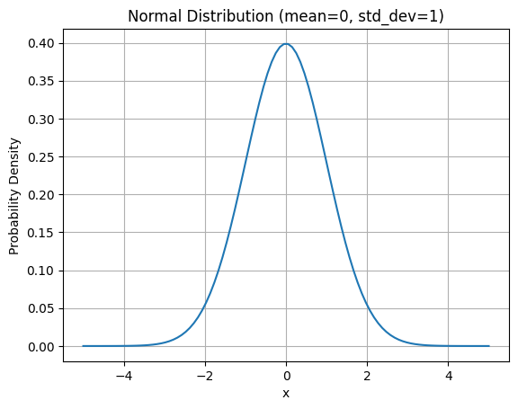

# Section One - Mathematical foundations

In this section, I will cover:

- Linear algebra
  - Vectors, matrices
  - Eigenvalues / eigenvectors
- Calculus
  - Derivatives & partial derivatives
- Probability & statistics
  - Hypothesis testing & the null hypothesis
  - p-values
  - Random variables
  - Distributions
  - Expectation, variance
  - Conditional probability

## Linear algebra

**Vector addition** is simple. In the following example, $\mathbf{a} = (a_1, a_2, ..., a_n)$ and $\mathbf{b} = (b_1, b_2, ..., b_n)$. They are vectors in n-dimensional space.

$$\mathbf{a} + \mathbf{b} = (a_1 + b_1, a_2 + b_2, ..., a_n + b_n)$$.

**Vector multiplication** - any number used to stretch or squash (multiply) a vector may be referred to as a **scalar**.

$$ \mathbf{2} \cdot \mathbf{a} = (2a_1, 2a_2, ..., 2a_n) $$

The above could just as well be written as this, same thing:

$$
2 \cdot
\begin{bmatrix}
    a_1 \\
    a_2 \\
    ... \\
    a_n
\end{bmatrix}=
\begin{bmatrix}
    2a_1 \\
    2a_2 \\
    ... \\
    2a_n
\end{bmatrix}
$$

**Matrix multiplication ('dot product')** - the product of two matrices is defined as below. Each row or column of a matrix can be thought of as a vector.

$$
\begin{bmatrix}
1 & 2 & 4 \\
2 & -1 & -4 \\
2 & 1 & 5
\end{bmatrix} \cdot
\begin{bmatrix}
x \\
y \\
z
\end{bmatrix}=
\begin{bmatrix}
b_1 \\
b_2 \\
b_3
\end{bmatrix}
$$

$$
\begin{aligned}
1x + 2y + 4z &= b_1 \\
2x - 1y - 4z &= b_2 \\
2x + 1y + 5z &= b_3
\end{aligned}
$$

So, a matrix is a transformation. A transformation will usually rotate, stretch or squeeze a vector - but not all, of course. If a vector does not change direction when the transformation is applied, it is an **eigenvector**. The amount the vector is stretched / squeezed is the **eigenvalue**.

Vector **v** is an **eigenvector** of matrix **A** if:

$$
vA = \lambda v
$$

where $\lambda$ is the eigenvalue.

## Calculus

Given a formula $f(x) = x^2$, given a value of $x$, we can calculate the value of $f(x)$. We could use this to plot a graph of $f(x)$, which would be a parabola:

  

To get the gradient of _f(x)_, we need the **derivative**. To get a derivative, we use these rules below. For the example, we only need the power rule, which gives us $f'(x) = 2x$.

- Power rule: $\frac{d}{dx} x^n = nx^{n-1}$
- Sum rule: $\frac{d}{dx} (f(x) + g(x)) = \frac{d}{dx} f(x) + \frac{d}{dx} g(x)$
- Product rule: $\frac{d}{dx} (f(x)g(x)) = f'(x)g(x) + f(x)g'(x)$
- Quotient rule: $\frac{d}{dx} \left( \frac{f(x)}{g(x)} \right) = \frac{f'(x)g(x) - f(x)g'(x)}{g(x)^2}$
- Chain rule: $\frac{d}{dx} f(g(x)) = f'(g(x)) \cdot g'(x)$

But what if we have a function with more than one variable? Take the following example:

$$
f(x,y) = x^2y + sin(y)
$$

In this function above, we can solve the **partial derivative** with repect to $x$ and $y$ separately. To do this, we treat the other variable as a constant. The symbol for a partial derivative is $\frac{\partial}{\partial x}$, which is read as 'the partial derivative with respect to x'.

$$
\frac{\partial f}{\partial x} = 2xy
$$

$$
\frac{\partial f}{\partial y} = x^2 + cos(y)
$$

A little more on the **chain rule**, important for backpropagation in neural networks. The chain rule allows us to compute the derivative of a composite function. For example, if we have a function $f(g(x))$, we can find its derivative using the chain rule:

$$
\frac{d}{dx} f(g(x)) = f'(g(x)) \cdot g'(x)
$$

Basically you use it when there is a function inside another function. An example, lets try to derive $h(x) = (sinx)^2$. We think of $f(g(x))$ as $(sin x)^2$ and g(x) as $sin x$. So, we can apply the chain rule:

$$
h'(x) = 2(sinx) \cdot cosx
$$

## Probability & statistics

**Variance** is calculated as the average of the squared differences from the mean. The formula for variance is:

$$
\sigma^2 = \frac{1}{n} \sum_{i=1}^{n} (x_i - \mu)^2
$$

where $\sigma^2$ is the variance, $n$ is the number of observations, $x_i$ is each observation, and $\mu$ is the mean. We write $\sigma^2$ because it's just the square of the standard deviation $\sigma$.

**Expected value** is the average value of a random variable. It is calculated as:
$$
E[X] = \sum_{i} x_i P(X = x_i)
$$
where $E[X]$ is the expected value of the random variable $X$, $x_i$ are the possible values of $X$, and $P(X = x_i)$ is the probability that $X$ takes on the value $x_i$.

**Bias** is the difference between the expected value of an estimator and the true value of the parameter being estimated. It can be calculated as:

$$
\text{bias} = E[\hat{\theta}] - \theta
$$

where $E[\hat{\theta}]$ is the expected value of the estimator $\hat{\theta}$ and $\theta$ is the true value of the parameter. So it shows how good the estimator is.

**Probability distributions** describe the probability of an event occuring. The **normal**, or **Gaussian distrubution** is a symmetric, bell-shaped continuous distribution. 
* Always centered on the mean, $\mu$.
* The spread of the distribution (width of curve) is determined by the standard deviation, $\sigma$ ($\sigma = \sqrt{variance}$).
* 95% of the data will sit within 2 standard deviations $\sigma$ of the mean $\mu$.

The formula of the normal distribution is:
$$
f(x) = \frac{1}{\sigma \sqrt{2\pi}} e^{-\frac{(x - \mu)^2}{2\sigma^2}}
$$

  

Now for the **Binomial distribution**, **p values** and **hypothesis testing**. The binomial distribution models the number of successes in a fixed number of independent Bernoulli trials (trials with two possible outcomes, like success/failure). The formula for the binomial distribution is:

$$
p(x | n, p) = (\frac{n!}{x!(n-x)!}) p^x (1-p)^{n-x}
$$

where $n$ is the number of trials, $p$ is the probability of success on an individual trial, and $x$ is the number of successes. 

$$
(\frac{n!}{x!(n-x)!})
$$
is called the binomial coefficient, it counts the number of ways to choose $x$ successes from $n$ trials. It can be denoted also as $\binom{n}{x}$.

So if we flip a coin 10 times, and we get heads 8 times, we can test our hypothesis that $p(heads) = 0.5$ using the binomial distribution. We can calculate the probability of getting 8 **or more** heads out of 10 flips (use the binomial distribution with x = 8, then 9, then 10, then sum the probabilities) under the null hypothesis that the coin is fair. This summed probability is called the **p-value**. If the p-value is very small (e.g., less than 0.05), we would reject the null hypothesis and conclude that the coin is likely biased towards heads.

* **Bernoulli trial** - an experiment with two possible outcomes.
* **Hypothesis** - A claim or assumption to test.
* **Null hypothesis ($H_0$)** - A default assumption that there is no effect or relationship. In the coin flip example, the null hypothesis is that the coin is fair (p = 0.5).
* **Alternative hypothesis ($H_1$)** - The opposite of the null hypothesis, it is what we want to provide evidence for. In the coin flip example, the alternative hypothesis is that the coin is biased towards heads (p > 0.5).
* **P-value** - The probability of observing the data we observed (or something more extreme) under the null hypothesis. A small p-value indicates that the observed data is unlikely under the null hypothesis, leading us to reject the null hypothesis in favor of the alternative hypothesis.
* **One vs two-sided test** - A one-sided test looks for an effect in only one direction (e.g., p > 0.5), while a two-tailed test looks for an effect in both directions (e.g., p ≠ 0.5). In the coin flip example, if we were testing for bias towards heads or tails, we would use a two-tailed test. The xample above is a one-tailed test because we are only looking for bias towards heads (we check $p(x=8)$, $p(x=9)$, $p(x=10)$). If we were looking for bias towards heads or tails, we would check $p(x=0)$, $p(x=1)$, ..., $p(x=10)$ and sum the probabilities of getting 0, 1, 9 or 10 heads (the extreme values in both directions).

**Random variables** are variables that can take on different values based on chance. They map outcomes to numbers. They can be discrete (taking on specific values) or continuous (taking on any value within a range). For example, the number of heads in 10 coin flips is a discrete random variable, while the height of a person is a continuous random variable. For example if we flip a coin, we can represent the outcome as a random variable $X$ where:
$$
X={\frac{1 | heads}{0 | tails}}
$$

Or lets say we roll a dice 7 times. We want to find the probability that the sum is > 30. Instead of writing P(sum of 7 dice rolls > 30), we can define a random variable $X$ as the sum of the 7 dice rolls. Then we can write P(X > 30).

A random variable is NOT a normal variable. With normal variables you can assign values and solve for, but random variables take on different values based on probabiliies. 

**Entropy** is a measure of uncertainty or randomness in a random variable. It quantifies the amount of information needed to describe the random variable. It is simple to calculate. It is the **expected value of surprise** of a random variable, where **surprise** is $log(1/p(x))$. Inversely correlated to probability (if something is very likely, it's not very surprising..). Super easy to derive from definition of expected value + definition of surprise:

$$
\begin{aligned}
H(X) &= E[\log(1/p(x))] \\
&= \sum_{i} \log(1/p(x_i)) p(x_i) \\
&= \sum_{i} (\log(0) - \log(p(x_i))) p(x_i) \\
&= -\sum_{i} \log(p(x_i)) p(x_i)
\end{aligned}
$$

