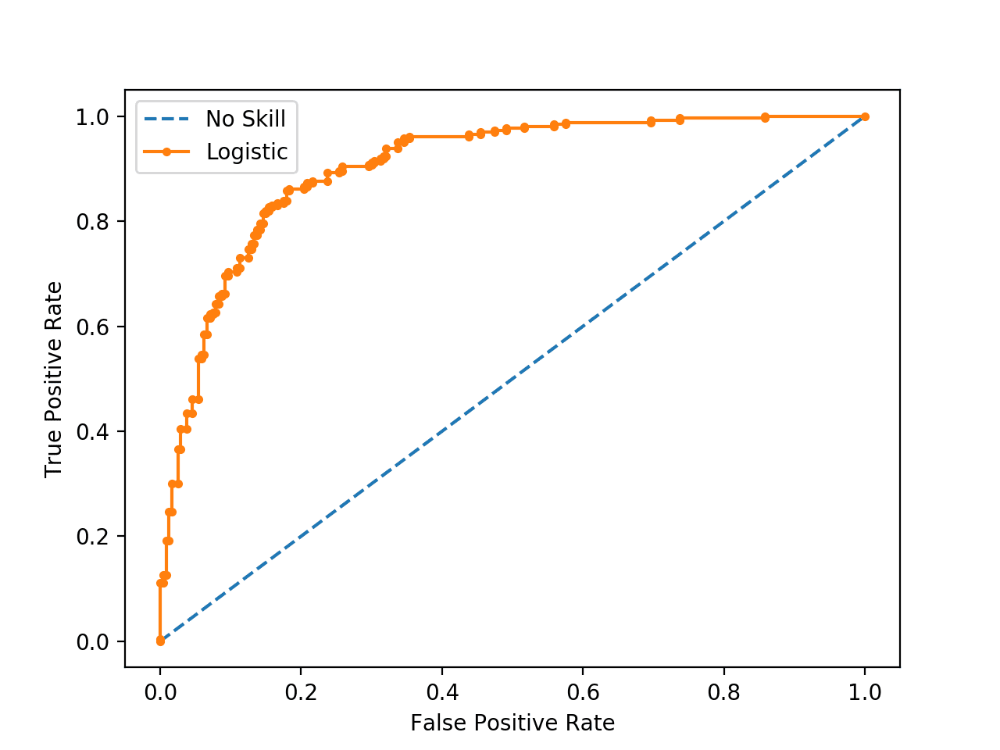

# Core ML concepts

In this section, I will go over:

- Supervised vs unsupervised learning
- Training vs testing vs validation data
- Overfitting vs underfitting
- Model evaluation metrics (accuracy, precision, recall, F1 score, confusion matrix, ROC AUC). 

## Supervised vs unsupervised learning

Supervised learning means you have labeled data. Unsupervised... does not.

**Supervised learning** is used for:
- Classification (predicting a discrete class, e.g. is this email spam or not?) 
    - Linear classifiers
    - Support vector machines (SVMs)
    - Decision trees
    - Random forests
    - Logistic regression
- Regression (predicting a continuous value, e.g. price, probability)
    - Linear regression

**Unsupervised learning** is used for:
- Clustering (grouping similar data points together, e.g. customer segmentation)
    - K-means
    - Hierarchical clustering
    - DBSCAN
- Association (look for patterns in data, e.g. market basket analysis)
- Dimensionality reduction (reducing the number of features while retaining important information, e.g. for visualization or noise reduction)
    - Autoencoders

## Training vs testing vs validation data

- **Training data** is the data used to train the model. The model learns from this data by adjusting its parameters to minimize the error between its predictions and the actual labels.
- **Testing data** is the data used to evaluate the model's performance after training. It provides an unbiased estimate of how well the model generalizes to new, unseen data.
- **Validation data** is used to tune the model's hyperparameters and select the best-performing model during the training process. It helps prevent overfitting by providing a separate dataset to evaluate the model's performance during training.

So the typical workflow is:
1. Split your dataset into training, validation, and testing sets (e.g., 70% training, 15% validation, 15% testing).
2. Train your model on the training data.
3. Use the validation data to tune hyperparameters and select the best model.
4. Finally, evaluate the selected model on the testing data.

## Overfitting vs underfitting

- **Overfitting** occurs when a model learns the training data too well, including its noise and outliers, resulting in poor generalization to new data. An overfitted model has low bias (extremely well fit to the training data) but high variance (small changes in the training data lead to large changes in the model).

- **Underfitting** occurs when a model is too simple to capture the underlying patterns in the data, resulting in poor performance on both the training and testing data. An underfitted model has high bias but low variance.

## Model evaluation metrics

- **True Positives (TP)**: Positive instances correctly classified as positive.
- **True Negatives (TN)**: Negative instances correctly classified as negative.
- **False Positives (FP)**: Negative instances incorrectly classified as positive.
- **False Negatives (FN)**: Positive instances incorrectly classified as negative.

*The first char is if the prediction was correct, the second char is what the prediction was.*

**Accuracy** is the proportion of correct predictions (both true positives and true negatives) out of all predictions made. Can be misleading when the classes are imbalanced. It is calculated as:

$$\text{Accuracy} = \frac{TP + TN}{TP + TN + FP + FN}$$

**Precision** focusses only on positive predictions, it is the proportion of true positives out of all positive predictions made by the model. It is calculated as:

$$\text{Precision} = \frac{TP}{TP + FP}$$

**Recall / Sensitivity** focusses only on actual positive instances, it is the proportion of true positives out of all actual positive instances. It is calculated as:

$$\text{Recall} = \frac{TP}{TP + FN}$$

Example with a spam email classifier:
- Accuracy: Out of all predictions, what proportion were correct?
- Precision: What proportion of the emails classified as spam, actually spam?
- Recall: What proportion of spam was correctly classified?

**F1 Score** combines precision and recall into a single metric. It is calculated as:

$$\text{F1 Score} = 2 \times \frac{\text{Precision} \times \text{Recall}}{\text{Precision} + \text{Recall}}$$

For a good F1 score, both precision and recall need to be high. It is especially useful when the classes are imbalanced.

** ROC AUC (Receiver Operating Characteristic Area Under the Curve)** is a metric that evaluates the performance of a binary classifier across different threshold settings. 

The ROC curve plots the true positive rate (recall) against the false positive rate $(FP / (FP + TN))$ at various threshold levels. The AUC represents the area under this curve, with a value of 1 indicating a perfect classifier and a value of 0.5 indicating a random classifier. A higher AUC indicates better model performance in distinguishing between the positive and negative classes.

todo: 

Loss functions
