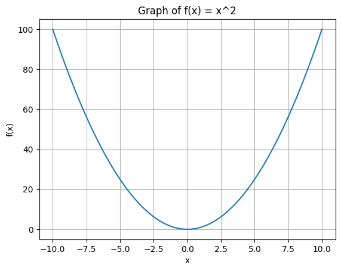

# Section One - Mathematical foundations

This documentation serves as my rehashing of ML and AI, going back to the mathematical foundations before building up to more complex topics like neural networks and deep learning concepts. It will be missing things I do not want to cover, but will expand as I go.

In this section, I will cover:

- Linear algebra
  - Vectors, matrices
  - Eigenvalues / eigenvectors
- Calculus
  - Derivatives & partial derivatives
- Probability & statistics
  - Hypothesis testing & the null hypothesis
  - p-values
  - Random variables
  - Distributions
  - Expectation, variance
  - Conditional probability

## Linear algebra

**Vector addition** is simple. In the following example, $\mathbf{a} = (a_1, a_2, ..., a_n)$ and $\mathbf{b} = (b_1, b_2, ..., b_n)$. They are vectors in n-dimensional space.

$$\mathbf{a} + \mathbf{b} = (a_1 + b_1, a_2 + b_2, ..., a_n + b_n)$$.

**Vector multiplication** - any number used to stretch or squash (multiply) a vector may be referred to as a **scalar**.

$$ \mathbf{2} \cdot \mathbf{a} = (2a_1, 2a_2, ..., 2a_n) $$

The above could just as well be written as this, same thing:

$$
2 \cdot
\begin{bmatrix}
    a_1 \\
    a_2 \\
    ... \\
    a_n
\end{bmatrix}=
\begin{bmatrix}
    2a_1 \\
    2a_2 \\
    ... \\
    2a_n
\end{bmatrix}
$$

**Matrix multiplication ('dot product')** - the product of two matrices is defined as below. Each row or column of a matrix can be thought of as a vector.

$$
\begin{bmatrix}
1 & 2 & 4 \\
2 & -1 & -4 \\
2 & 1 & 5
\end{bmatrix} \cdot
\begin{bmatrix}
x \\
y \\
z
\end{bmatrix}=
\begin{bmatrix}
b_1 \\
b_2 \\
b_3
\end{bmatrix}
$$

$$
\begin{aligned}
1x + 2y + 4z &= b_1 \\
2x - 1y - 4z &= b_2 \\
2x + 1y + 5z &= b_3
\end{aligned}
$$

So, a matrix is a transformation. A transformation will usually rotate, stretch or squeeze a vector - but not all, of course. If a vector does not change direction when the transformation is applied, it is an **eigenvector**. The amount the vector is stretched / squeezed is the **eigenvalue**.

Vector **v** is an **eigenvector** of matrix **A** if:

$$
vA = \lambda v
$$

where $\lambda$ is the eigenvalue.

## Calculus

Given a formula $f(x) = x^2$, given a value of $x$, we can calculate the value of $f(x)$. We could use this to plot a graph of $f(x)$, which would be a parabola:

To get the gradient of _f(x)_, we need the **derivative**. To get a derivative, we use these rules below. For the example, we only need the power rule, which gives us $f'(x) = 2x$.

- Power rule: $\frac{d}{dx} x^n = nx^{n-1}$
- Sum rule: $\frac{d}{dx} (f(x) + g(x)) = \frac{d}{dx} f(x) + \frac{d}{dx} g(x)$
- Product rule: $\frac{d}{dx} (f(x)g(x)) = f'(x)g(x) + f(x)g'(x)$
- Quotient rule: $\frac{d}{dx} \left( \frac{f(x)}{g(x)} \right) = \frac{f'(x)g(x) - f(x)g'(x)}{g(x)^2}$
- Chain rule: $\frac{d}{dx} f(g(x)) = f'(g(x)) \cdot g'(x)$

But what if we have a function with more than one variable? Take the following example:

$$
f(x,y) = x^2y + sin(y)
$$

In this function above, we can solve the **partial derivative** with repect to $x$ and $y$ separately. To do this, we treat the other variable as a constant. The symbol for a partial derivative is $\frac{\partial}{\partial x}$, which is read as 'the partial derivative with respect to x'.

$$
\frac{\partial f}{\partial x} = 2xy
$$

$$
\frac{\partial f}{\partial y} = x^2 + cos(y)
$$

A little more on the **chain rule**, important for backpropagation in neural networks. The chain rule allows us to compute the derivative of a composite function. For example, if we have a function $f(g(x))$, we can find its derivative using the chain rule:

$$
\frac{d}{dx} f(g(x)) = f'(g(x)) \cdot g'(x)
$$

Basically you use it when there is a function inside another function. An example, lets try to derive $h(x) = (sinx)^2$. We think of $f(g(x))$ as $(sin x)^2$ and g(x) as $sin x$. So, we can apply the chain rule:

$$
h'(x) = 2(sinx) \cdot cosx
$$

## Probability & statistics

**Variance** is calculated as the average of the squared differences from the mean. The formula for variance is:

$$
\sigma^2 = \frac{1}{n} \sum_{i=1}^{n} (x_i - \mu)^2
$$

where $\sigma^2$ is the variance, $n$ is the number of observations, $x_i$ is each observation, and $\mu$ is the mean.

**Expected value** is the average value of a random variable. It is calculated as:
$$
E[X] = \sum_{i} x_i P(X = x_i)
$$
where $E[X]$ is the expected value of the random variable $X$, $x_i$ are the possible values of $X$, and $P(X = x_i)$ is the probability that $X$ takes on the value $x_i$.

**Bias** is the difference between the expected value of an estimator and the true value of the parameter being estimated. It can be calculated as:

$$
\text{bias} = E[\hat{\theta}] - \theta
$$

where $E[\hat{\theta}]$ is the expected value of the estimator $\hat{\theta}$ and $\theta$ is the true value of the parameter. So it shows how good the estimator is.
